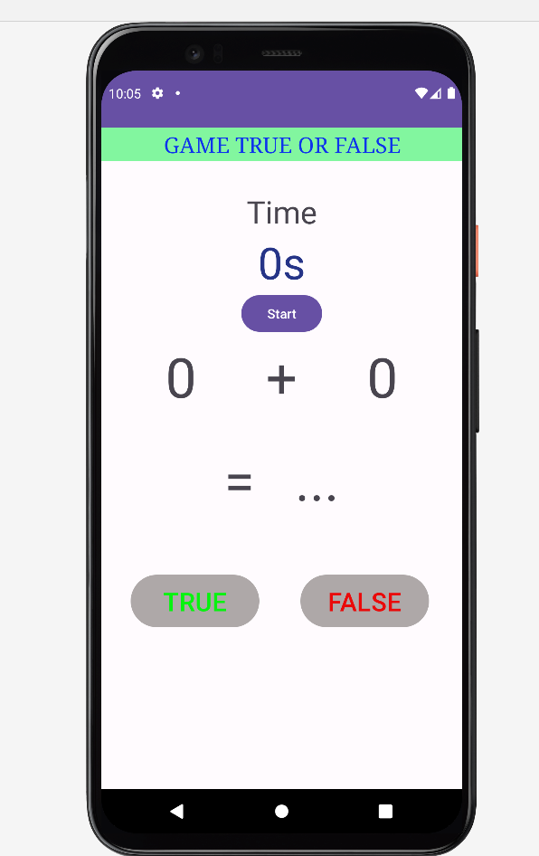
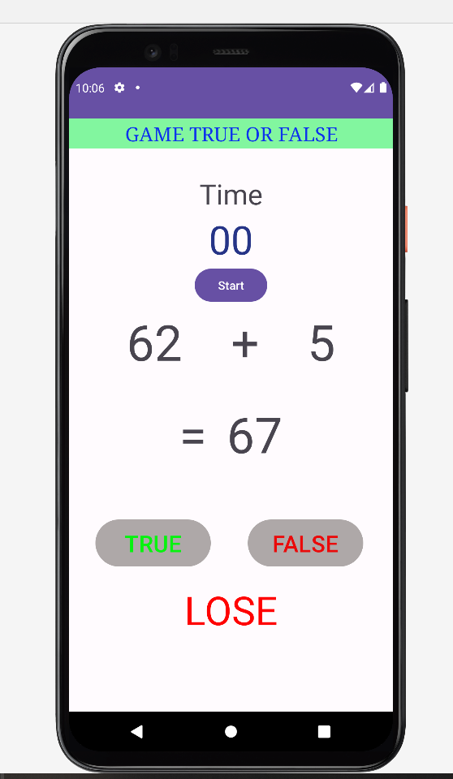
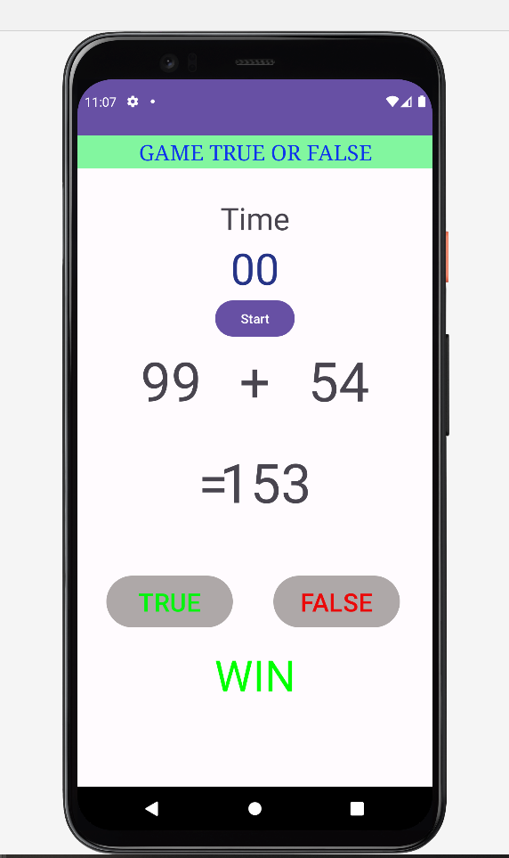

# 1.Yêu cầu:
- Tính theo máy và cho biết kết quả đúng hay sai.
- Nếu đúng 10 lần liên tiếp sẽ hiện chữ "**Win**", ngược lại hiện chữ "**Lose**", lúc này thời gian chương trình sẽ dừng lại. 
- Thời gian đếm ngược của mỗi ván là 3 giây, khi hết thời gian bạn sẽ thua và hiện chữ "**Lose**".
# 2. Mô tả màn hình:
### 2.1 Màn hình chính  

### 2.2 Màn hình khi thua

### 2.3 Màn hình khi thắng 
